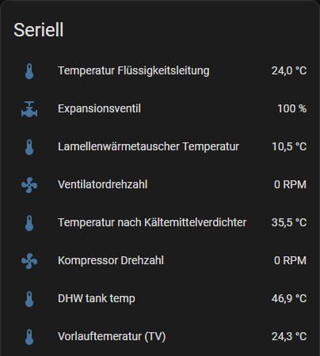
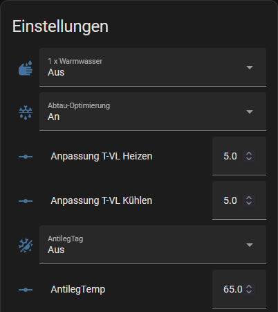
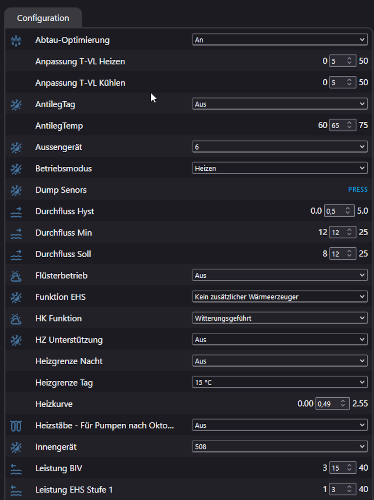

#### Language Selection:

 

# Rotex / Daikin HPSU CAN
**Daikin-Rotex-HPSU-CAN** ist eine flexible Standalone-Lösung zum Auslesen und Steuern von Rotex/Daikin Luftwärmepumpen über den CAN-Bus.
Die Steuerung und der Datenzugriff erfolgen wahlweise über den integrierten Webserver oder bequem über Home Assistant bzw. ioBroker.

Als Hardware wird ein **ESP32** benötigt, der eine Baudrate von **20 kbit/s** unterstützt.  
Erfolgreich getestet wurden das **ESP32-S3-WROOM-Board** und ein **WaveShare ESP32-S3 Mini**.  
Eine Übersicht weiterer Varianten und deren unterstützte Bitrate findest du in der folgenden [Tabelle](https://esphome.io/components/canbus/esp32_can).  

Zusätzlich ist ein kompatibler **CAN-Transceiver** erforderlich, wie der **Waveshare SN65HVD230** (3,3V).

## Homeassistant - Dashboard

## Home Assistant - Sensoren

## Home Assistant - Einstellungen

## Integrierter ESP Webserver (ohne Home Assistant nutzbar)

## Achtung!!
Die Verwendung von Daikin-Rotex-HPSU-CAN kann potenziell Ihr Heizsystem beschädigen. Die Nutzung erfolgt auf eigene Verantwortung. Ich übernehme keine Haftung für entstandene Schäden.

Bitte beachten Sie, dass durch die Verwendung von Daikin-Rotex-HPSU-CAN möglicherweise Ihre Garantie sowie der Support durch den Hersteller erlischt!

# Installationsanleitung (Standalone):

### Schritt 1: Vorbereitung

1. **Browser:** Verwende **Google Chrome** (Safari und Firefox werden nicht unterstützt).
2. **Firmware:** Lade die Datei `rotex.factory-tx05-rx06.bin` aus dem Ordner `.bin` herunter.

### Schritt 2: ESP32 flashen

1. Öffne die Webseite [https://web.esphome.io](https://web.esphome.io).
2. Verbinde den ESP32 per USB-C-Kabel mit deinem PC.
3. Klicke auf der Webseite auf „**Connect**“ und wähle im erscheinenden Fenster die USB-Serial-Schnittstelle aus.
4. Klicke anschließend auf „**Installieren**“.
5. Wähle die heruntergeladene Datei `rotex.factory-tx05-rx06.bin` aus und klicke erneut auf „**Installieren**“. Der Vorgang dauert etwa 2 Minuten.

### Schritt 3: WLAN-Verbindung des ESP32 konfigurieren

1. Starte den ESP32 neu und warte ca. 1–2 Minuten, bis der „Rotex Fallback Hotspot“ vom ESP32 erstellt wird.
2. Verbinde dich mit dem Hotspot (Passwort: `H3jGqANSa7aL`).
3. Öffne die Webseite [http://192.168.4.1](http://192.168.4.1) oder [http://rotex.local](http://rotex.local) im Browser.
4. Gib deine WLAN-SSID und dein WLAN-Passwort ein, um den ESP32 mit deinem Netzwerk zu verbinden.

### Schritt 4: Prüfung der Netzwerkverbindung

- Der ESP32 sollte nun über [http://rotex.local](http://rotex.local) erreichbar sein.  
- Falls dies nicht funktioniert, überprüfe bitte die IP-Adresse des ESP32 in deinem Router.

## Abschluss

Die Installation ist nun abgeschlossen, und das System kann nach den Schaubild **Pinbelegung GPIO 5 und 6 (Bin Datei)** mit der Rotex/Daikin-Anlage verbunden werden.

# :sparkles: Congratulation! :sparkles:

  

## Features:

- 1x Warm Wasser Taste ohne Heizstab (es wird für 10s auf 70Grad gestellt und dann wieder auf den vorher eingestellten Wert zurück)
- Thermische Leistungsberechnung
- Heizkurven Verstellung in 0.01 Schritten (Standard in 0.1 Schritten)
- Zwei neue Schalter angelegt um auch die Thermostat Eingänge von der Rotex / Daikin direkt zwischen Heizen / Kühlen umzuschalten.
- Neues Feature Fehlercode Anzeige mit Beschreibung des Fehlers mit Handbuch Seitenangabe!!
  
   

Wer Abtauprobleme hat, kann das neue Feature "Defrost" direkt über den ESP nutzen. So wird max 0.7 Grad Warmwasser aus dem Sepicher verbraucht.

Getestet mit: 
- Rotex HSPU Compact 508 8kw mit Rocon BM1, 
- ROTEX HPSU compact Ultra
- Dakin ECH2O (bis 01/2022)

## Pinbelegung GPIO 47 und 48 (yaml)

## Pinbelegung GPIO 5 und 6 (Bin Datei)

## Pin Belegung an der Rotex HPSU

## DIY Platine von (Dornieden)

mehr dazu im Discusions Forum https://github.com/Trunks1982/Daikin-Rotex-HPSU-CAN/discussions/35:  
https://github.com/Trunks1982/Daikin-Rotex-HPSU-CAN/blob/main/DIY-Platine/README

# Telegram Gruppenchat
https://t.me/+C1iVhAjaENw0ODY0

  
"Ein Kaffee für nächste lange Nacht vor dem Rechner wäre toll" ist aber natürlich kein muss.
 

